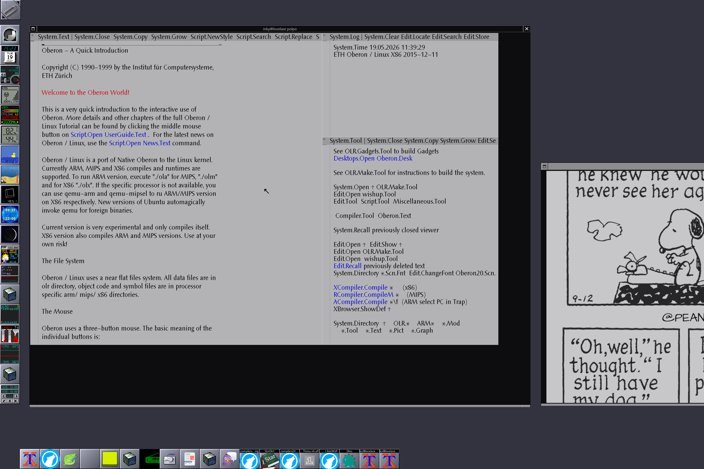

# POLPO
## platform orbiting linux: project oberon

This is an attempt to contunie development of ETH Linux Oberon in some way.

### Goals

* Create minimal set of CLI modules, working compiler, and loader of Obj files - done.
* Create a minimal Oberon OS that runs over Linux - only minimal set of modules. - done.
* Add package manager to add packages over the network.
* Create a ports tree of package recipies.
* Also integrate ARM and other existing compilers.
* Add support for aarch64 and x86_64.
* Build also bootable on X86 machine version of Oberon on Linux
* Build also bootable on some ARM devices version of Oberon on Linux

## How to play

Type `make` and `wishup` shell will load object files from x86 directory and rebuild link itself as static Linux binary.

Look at [compiler options](compiler_options.md) or do

```
./wishup nXCompiler.Help
```

Compile hello world example:

```
./wishup nXCompiler.Compile hello.Mod
```

Run:

```
./wishup hello.world
```

### X11 Oberon

Currently whole Oberon system gets build with minimal set of modules. So after you built with `make` you will find `xoberon` binary.

```
./xoberon
```

That is a statically linked x86 executable that will start loading modules and form whole Oberon operating system.

Now it can draw itself in an X11 window.
But wait, it can also draw itself in other ways! Just replace the Display module.

### xterm Oberon



Oberon can draw itself not only in X11, but in a bitmap graphics capable Unix terminal, such as xterm.
For that you need to compile other version of Display and Input modules.

```
make sixel
```

This will replace compiled Display.Obj and Input.Obj with the versions that work in xterm.

After that we suggest to use supplied `run.vt.sh` script that will open a conveniently big xterm and load oberon that would draw itself in it.

Same xoberon binary (no need for recompilation) will load modules, including Display and Input(but those are different Display and Input now), and the OS will now work in the terminal.

Since Oberon now draws itself in the VT320 capable Unix terminal, you can also run it via ssh.

To use X11 mode again, type:

```
make x11
```

#### Other terminals

In theory, mlterm should also work, at least they claim they support sixel mode.

And we don't know how xterm of your OS is compiled. We tested with xterm on Gentoo that is compiled with 'sixel' USE flag. Our friend confirmed that it worked on their Arch. Our other friend confirmed it didn't work on their Debian.

---


Wait for us for updates, or join #oberon on irc.libera.chat and help with development!
At least, we want to add ARM and other compilers, integrate vipak package manager, and run the os also natively. We also want to have 64-bit compiler backends.

Till.
