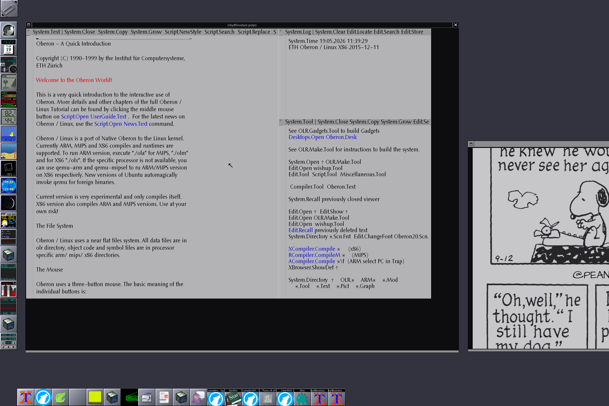

# POLPO
## platform orbiting linux: project oberon

This is an attempt to contunie development of ETH Linux Oberon in some way.

### Goals

* Create minimal set of CLI modules, working compiler, and loader of Obj files - done.
* Create a minimal Oberon OS that runs over Linux - only minimal set of modules. - done.
* Add package manager to add packages over the network.
* Create a ports tree of package recipies.
* Also integrate ARM and other existing compilers.
* Add support for aarch64 and x86_64.
* Build also bootable on X86 machine version of Oberon on Linux
* Build also bootable on some ARM devices version of Oberon on Linux

## How to play

Type `make` and `wishup` shell will load object files from x86 directory and rebuild link itself as static Linux binary.

Look at [compiler options](compiler_options.md) or do

```
./wishup nXCompiler.Help
```

Compile hello world example:

```
./wishup nXCompiler.Compile hello.Mod
```

Run:

```
./wishup hello.world
```

### X11 Oberon

Currently whole Oberon system gets build with minimal set of modules. So after you built with `make` you will find `xoberon` binary.

```
./xoberon
```

That is a statically linked x86 executable that will start loading modules and form whole Oberon operating system.

Now it can draw itself in an X11 window.
But wait, it can also draw itself in other ways! Just replace the Display module.

### xterm Oberon



Oberon can draw itself not only in X11, but in a bitmap graphics capable Unix terminal, such as xterm.
For that you need to compile other version of Display and Input modules.

```
make sixel
```

This will replace compiled Display.Obj and Input.Obj with the versions that work in xterm.

After that we suggest to use supplied `run.vt.sh` script that will open a conveniently big xterm and load oberon that would draw itself in it.

Same xoberon binary (no need for recompilation) will load modules, including Display and Input(but those are different Display and Input now), and the OS will now work in the terminal.

Since Oberon now draws itself in the VT320 capable Unix terminal, you can also run it via ssh.

To use X11 mode again, type:

```
make x11
```

#### Other terminals

In theory, mlterm should also work, at least they claim they support sixel mode.

And we don't know how xterm of your OS is compiled. We tested with xterm on Gentoo that is compiled with 'sixel' USE flag. Our friend confirmed that it worked on their Arch. Our other friend confirmed it didn't work on their Debian.

### HiDPI screens: font scaling

Screen fonts can be scaled, so that every text, including existing documents,
is shown larger with the real Syntax and Oberon bitmap fonts:

* `FontScale = 150` in the `System` section of `Oberon.Text`, or the environment
  variable `OFONTSCALE=150` (percent);
* `System.SetFontScale 200` changes it while Oberon runs: the fonts are reloaded,
  a message is broadcast and all viewers lay out their texts again;
* without a setting the scale follows the screen resolution reported by X11 or the
  framebuffer (96 dpi = 100%); many X servers report 96 dpi, so set it explicitly.

A text asking for `Syntax10.Scn.Fnt` gets the existing font nearest to 10 * scale / 100,
of the same family if possible (at 200% the real Syntax20), else of the Oberon family.
Texts keep their font names, so documents are stored unchanged. `LineSpacing = 150`
(percent of the font height, default 150) sets the spacing of lines in text viewers.

### ARM

polpo also runs on 32-bit ARM Linux. The ARM compiler is the ETH/OLR ARM
compiler (Oberon-1). Object files are in `obj/arm/`, the static executable is
`bin/arm/loksh`.

```
make arm            # on x86: cross compile the ARM system
make arm-native     # on ARM: rebuild it with the ARM compiler (on x86: under qemu-arm)
make arm-run        # start the ARM desktop (System.Init); on x86 through qemu-arm
make arm-shell      # ARM console
```

`make arm` runs `tools/arm-cross.Tool` (the x86-hosted cross tools `acompiler`
and `alinker`) and then `tools/arm.Tool` (the ARM system). `make arm-native`
runs only `tools/arm.Tool`, with the ARM compiler. Both link
`bin/arm/loksh.new` and move it to `bin/arm/loksh`.

Directly, from the polpo directory (prefix `qemu-arm` on x86):

```
bin/arm/loksh cat.Cat texts/UserGuide.Text
bin/arm/loksh compiler.Compile hello.Mod     # native ARM compiler
bin/arm/loksh hello.world
bin/arm/loksh System.Init                    # the Oberon desktop
```

On ARM, `compiler.Compile` and `linker.Link` are the ARM compiler and boot
linker. `make arm-sixel` and `make arm-x11` switch the ARM Display and Input
modules, like `make sixel` and `make x11` for x86.

### RISC-V

polpo runs on 32-bit RISC-V (RV32) Linux too. The compiler is OLR's OP2-based
ROP2 compiler (shared front end `ROPM`..`ROPP`, RISC-V back end `VOPL`..`VOPV`).
Object files are in `obj/riscv/`, the static executable is `bin/riscv/loksh`.

```
make riscv          # on x86: cross compile the RISC-V system
make riscv-native   # rebuild it with the RISC-V compiler (on x86: under qemu-riscv32)
make riscv-run      # start the RISC-V desktop (System.Init); on x86 through qemu-riscv32
make riscv-shell    # RISC-V console
```

`make riscv` runs `tools/rop2-cross.Tool` (the x86-hosted `rcompiler`, `rvcompiler`
and `rlinker`) and then `tools/riscv.Tool`. On RISC-V, `compiler.Compile` and
`linker.Link` are the RISC-V compiler and boot linker. The runtime uses the
Linux RV32 system calls (64-bit time, statx).

### MIPS

polpo runs on 32-bit little-endian MIPS (mipsel) Linux, with the same ROP2
compiler family and runtime as RISC-V and the MIPS back end `MOPL`..`MOPV`.
Object files are in `obj/mips/`, the static executable is `bin/mips/loksh`.

```
make mips           # on x86: cross compile the MIPS system
make mips-native    # rebuild it with the MIPS compiler (on x86: under qemu-mipsel)
make mips-run       # start the MIPS desktop (System.Init); on x86 through qemu-mipsel
make mips-shell     # MIPS console
```

On MIPS, `compiler.Compile` and `linker.Link` are the MIPS compiler and boot
linker. The compiler avoids misaligned word accesses (it uses LWL/LWR and
SWL/SWR where alignment is unknown), so no kernel fixups are needed.

### ARMv7

Besides the Oberon-1 ARM compiler for older ARM processors (`make arm`, `obj/arm/`),
polpo has an ARMv7 system built with OLR's OP2 ARM back end `AOPL`..`AOPV` from the
same ROP2 family as MIPS and RISC-V. Object files are in `obj/armv7/`, the static
executable is `bin/armv7/loksh`.

```
make armv7          # on x86: cross compile the ARMv7 system
make armv7-native   # rebuild it with the ARMv7 compiler (on x86: under qemu-arm)
make armv7-run      # start the ARMv7 desktop (System.Init); on x86 through qemu-arm
make armv7-shell    # ARMv7 console
```

The ARMv7 compiler uses software division by default, so the code also runs on
Cortex-A8 and A9, which have no divide instruction; `/d` selects the hardware `sdiv`.

Note: the ROP2 compilers (MIPS, RISC-V, ARMv7) trap on `DIV` and `MOD` by a divisor
that is not positive, while the x86 compiler computes the floored result.

### Layout

* `bin/<arch>/loksh` - static executables; run them from the polpo directory
* `obj/<arch>/` - object files loaded by `bin/<arch>/loksh`
* `src/cli` - console modules shared by all architectures; `src/cli/<arch>` - runtime
  (Linux0, Kernel, Modules0), compiler and linker of that architecture; `src/cli/rop2` -
  the ROP2 compiler front end, runtime (Kernel, Modules0) and boot linker shared by MIPS,
  RISC-V and ARMv7
* `src/common` - modules shared by console and desktop (Files, Texts0, Oberon0, ...)
* `src/desktop` - desktop modules shared by all architectures; `src/desktop/<arch>` -
  architecture dependent desktop modules (XCompiler, ACompiler, RCompiler, decoders, browsers, System on RISC-V)
* `tools/` - `.Tool` texts, including the build recipes `build.Tool`, `arm-cross.Tool`, `arm.Tool`, `rop2-cross.Tool`, `riscv.Tool`, `mips.Tool` and `armv7.Tool`
* `share/` - data files (`Default.Pal`, `OPA.Data`, `System.Text`, ...)
* `fonts/`, `texts/` - fonts and documentation texts; `Oberon.Text` is the configuration

`bin/<arch>/loksh` finds the polpo root from its own location (`/proc/self/exe`,
also through symlinks and `PATH`), or from the environment variable `POLPO`. So it
can be started from any directory: object files are loaded from `obj/<arch>/` in the
current directory if it exists there, else from the root. `Files.Old` looks for a plain
file name in the current directory, then in the root and its `share/`, `tools/` and
`fonts/`, so `Oberon.Text`, `Edit.Open System.Tool` and fonts are found from anywhere.

---


Wait for us for updates, or join #oberon on irc.libera.chat and help with development!
At least, we want to add ARM and other compilers, integrate vipak package manager, and run the os also natively. We also want to have 64-bit compiler backends.

Till.
